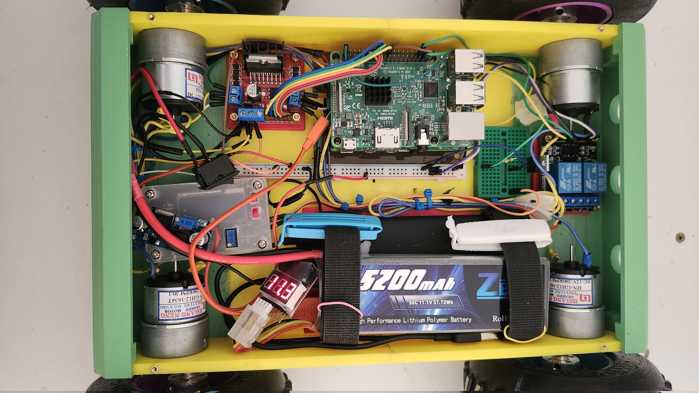
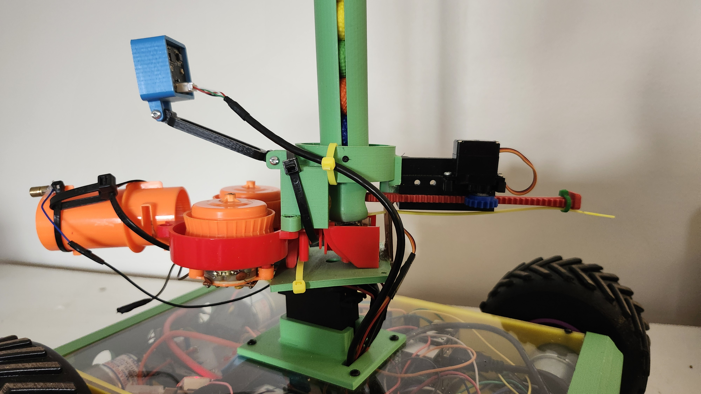
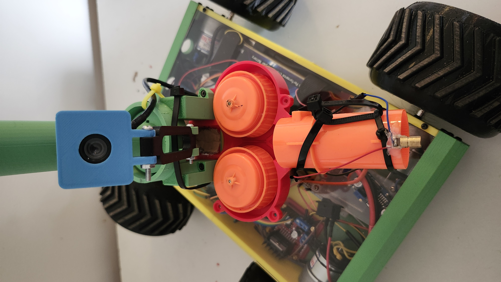
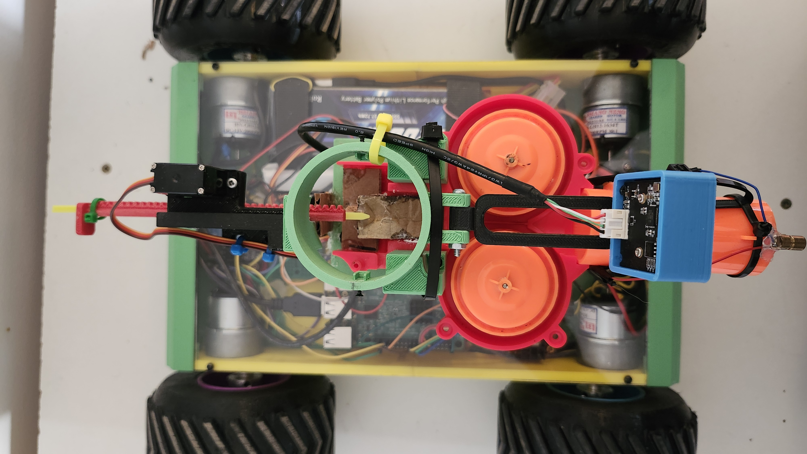

# Mobile Turret Robot
A differential drive robot, named Stroam, is equipped with a one degree of freedom turret that shoots foam balls. 
Currently, Stroam is only controlled manually where an Xbox 360 controller is used to drive and operate the turret.
Most of Stroam's software was built on the framework ROS2 Humble. Here's the link for a full video of manually operating Stroam: https://www.youtube.com/watch?v=MlZp5pD2vLs

    

    

## 🗃️ Package Overview
- [`stroam_bringup`](./bot_setup/startup/ros2_ws/src/stroam_bringup/) : Launches camera, robot manager, motor controller, and turret nodes.
- [`stroam_camera`](./bot_setup/startup/ros2_ws/src/stroam_camera/) : Lifecycle node that provides a turret view
- [`stroam_interfaces`](./bot_setup/startup/ros2_ws/src/stroam_interfaces) : Contains action definitions for motor controller and turret operations, as well as 
a message representing Xbox 360 controller inputs.
- [`stroam_manager`](./bot_setup/startup/ros2_ws/src/stroam_manager/) : The main node running on Stroam that routes and translates controller inputs into actions that are used by the motor controller and turret nodes.
- [`stroam_motor_controller`](./bot_setup/startup/ros2_ws/src/stroam_motor_controller/) : Contains an action server for operating Stroam's motors.
- [`stroam_turret`](./bot_setup/startup/ros2_ws/src/stroam_turret/) : Contains an action server for operating Stroam's one degree of freedom turret.
- [`remote_controller`](./remote_setup/ros2_ws/src/remote_controller/) : Contains a publishing node for Xbox 360 controller from a remote computer. 
## 🧰 Hardware

<table>
  <tr>
    <td></td>
    <td></td>
  </tr>
  <tr>
    <td></td>
    <td></td>
  </tr>
</table>

| | Components |
| --| --|
|1| Raspberry PI 3B+ | 
|2| 2 Channel Relay Module | 
|3| Motor Controller L298N |
|4| 2 X DC-DC Step Down Converter |
|5| [4 X DC-12V-200RPM Motors](https://ca.robotshop.com/products/lynxmotion-12vdc-200rpm-078kg-cm-ghm-16-w-rear-shaft?variant=42411388829847) | 
|7| NPN MOSFET |
|8| 460Ω Resistor |
|9| 5V Laser Diode |
|10| USB Camera |
|11| Servo MG996R |
|12| Servo (micro) MG90 |
|13| 12V, 5200mAh LIPO Battery |
|14| 5V, 10000mAh Battery Bank |

### 3D Printed Parts

The only stl files provided in this project are the ones used to build the chassis, given that the turret was a hacked design: turret is composed of 3D printed parts that are fitted to a shooting mechanism taken out a NERF Rival gun. The tires and rims are connected to motors shafts using [6mm universal hubs](https://ca.robotshop.com/products/lynxmotion-hub-02-universal-hub?variant=42413375488151) and 3D printed axel. However, the 3D printed axel was not used in this robot since they kept breaking due to radial load; instead some big bolts were machine down on a metal lath and fitted into the tires. And for the top chassis cover, a clear acyrlic sheet was cut out and fitted using a CNC machine (the stl file for this is found in the 3D_prints directory).

##  ⚡ Circuit Diagrams
The Raspberry PI 3B+ was powered using a 5V power bank while all other devices in the project were powered from the 12V LIPO battery.

### Turret Schematic 

  

Two step down converts were used to power devices for the turret system: 12V to 5V for devices like servos, laser diode and 2 channel relay module, and 12V to 8V for powering the shooting motors. As shown in the turret schematic, a NPN mosfet was used to turn on and off the laser diode by connecting a GPIO pin from the Raspberry PI to it's gate. 

### Drive System Schematic

  

As shown in the above schematic, a L298N motor controller is connected to a Rasberry PI 3B+ for operating the 4 DC motors.

## 🔮 Future Work
Currently, Stroam can only be operated manually; however, the plan is to provide the robot with the task of following a route with targets off to the side.
This task is meant to be performed autonmously and will be a computer vision application.
